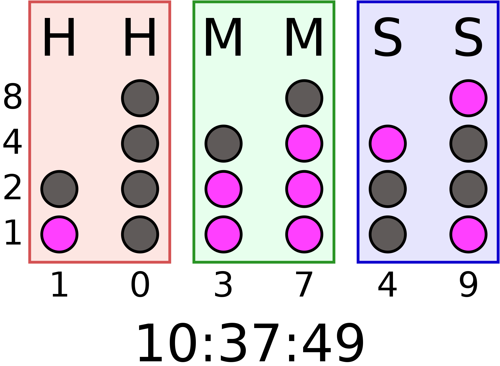

# BCD_Clock
This project aims to combine an [atomic clock receiver](https://universal-solder.ca/product/everset-es100-wwvb-starter-kit/) with a Pi Pico W and a [Pimoroni Stellar Unicorn](https://shop.pimoroni.com/products/space-unicorns?variant=40842632953939) to display the current time in binary coded decimal.

## Instructions

## Usage

## Output

